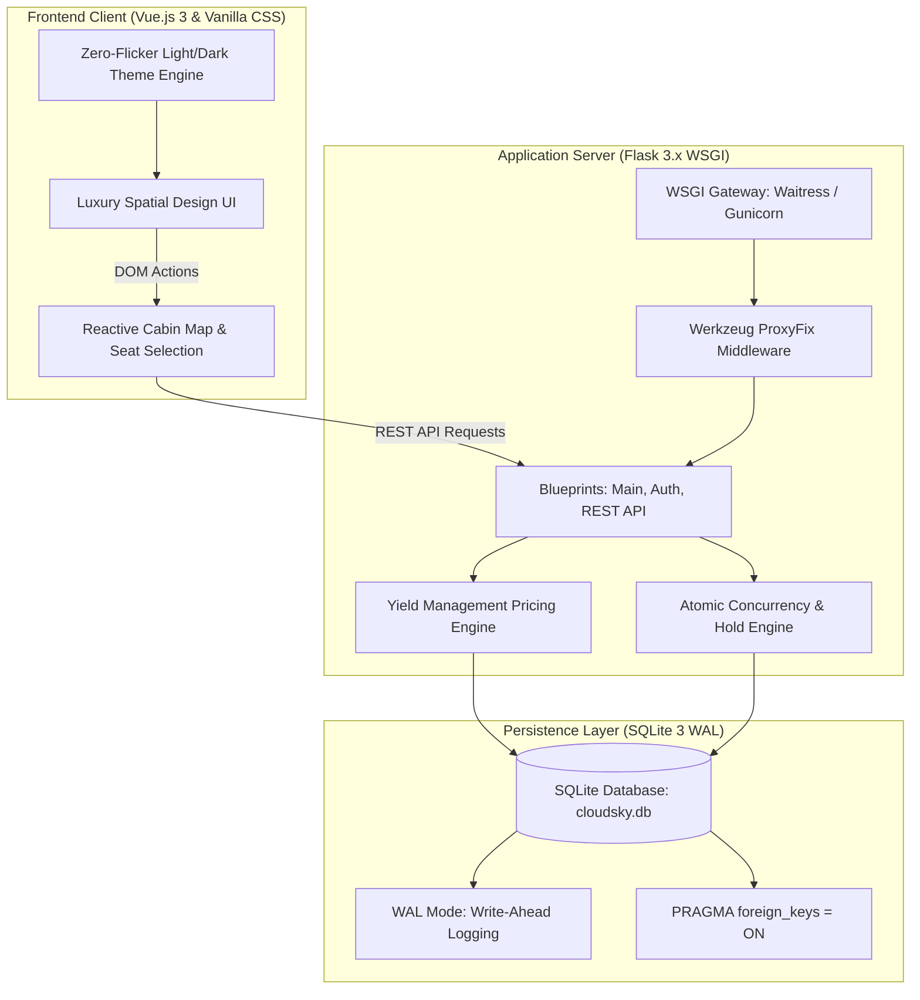
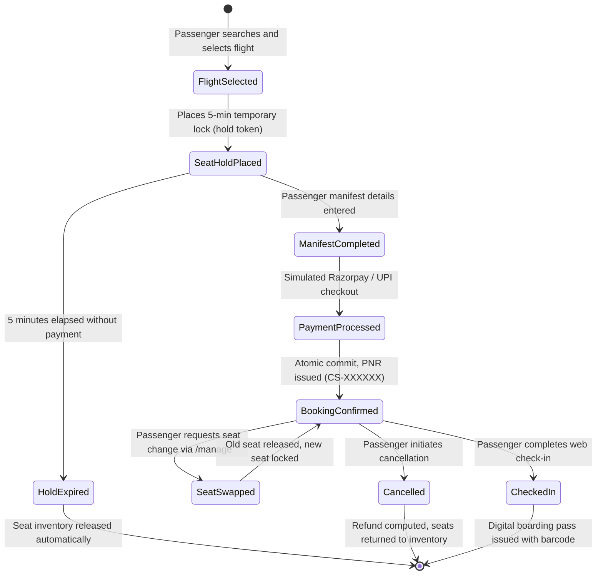

# CloudSky Airways — Commercial Airline Reservation & Flight Management Platform

[](https://flask.palletsprojects.com)
[](https://www.python.org)
[](https://www.sqlite.org)
[](https://vuejs.org)
[](https://www.docker.com)
[](https://docs.pytest.org)
[](https://github.com/nithin16-cloud/csa/actions)
[](https://opensource.org/licenses/MIT)

> **CloudSky Airways (CSA)** is an enterprise-grade commercial airline reservation, flight scheduling, and cabin simulator platform. It connects passengers, flight operations, and reservation administrators through an automated booking lifecycle—from dynamic flight catalog discovery and interactive 3-class cabin seat selection to real-time optimistic concurrency locking, automated yield management surge pricing, simulated payment gateway settlement, and self-service PNR web check-in.

---

## Quick Navigation

- [Key Features & Role Portals](#key-features--role-portals)
- [Algorithmic & Mathematical Foundations](#algorithmic--mathematical-foundations)
- [Architecture & Tech Stack](#architecture--tech-stack)
- [Repository Structure](#repository-structure)
- [Step-by-Step Setup Guide](#step-by-step-setup-guide)
  - [1. Backend & Application Setup](#1-backend--application-setup)
  - [2. Database Initialization & Seeding](#2-database-initialization--seeding)
  - [3. Running the Server](#3-running-the-server)
- [Default Demo Credentials](#default-demo-credentials)
- [Booking Lifecycle & Concurrency Pipeline](#booking-lifecycle--concurrency-pipeline)
- [Yield Management & Dynamic Surge Pricing](#yield-management--dynamic-surge-pricing)
- [Database Maintenance & CLI Tooling](#database-maintenance--cli-tooling)
- [Automated Testing Suite (Pytest)](#automated-testing-suite)
- [Production Deployment & Containerization](#production-deployment--containerization)

---

## Key Features & Role Portals

### 1. ✈️ Passenger Booking Portal (`/`, `/flights`, `/booking/<id>`)
- **Dynamic Flight Schedule Search**: Real-time flight schedule filtering across major domestic and international hubs (DEL, BOM, BLR, HYD, MAA, CCU, DXB, SIN, LHR, JFK) by departure time, aircraft model, and ticket fare.
- **Smart Route Fallback Engine**: Multi-tiered fallback logic that gracefully suggests available scheduled flights across alternative dates when exact date matches return empty.
- **Interactive Cabin Simulator**: Visual seat selection across First Class (lie-flat suites, 78" pitch), Business Class (42" pitch), and Economy Class (standard & 34" exit rows) with live amenity metadata (universal AC, 65W USB-C, recline angles).
- **Multi-Passenger Manifest**: Schedule individual or group bookings with custom passenger names, ages, and genders mapped directly to specific aircraft cabin coordinates.
- **Simulated Payment Gateway**: Instant Razorpay/UPI/Debit/Credit/NetBanking payment simulation generating airline-standard 6-character PNR booking reference codes (e.g., `CS-9X4A8B`).
- **Printable Boarding Pass**: High-fidelity digital boarding passes complete with flight routing telemetry, passenger manifest details, and simulated machine-readable barcodes.

### 2. 🎫 Passenger Self-Service & Web Check-in (`/manage`, `/dashboard`)
- **PNR Lookup & Reservation Retrieval**: Instant booking manifest retrieval using unique 6-character PNR code and passenger email authentication.
- **Interactive Seat Reassignment**: Real-time seat swap engine allowing passengers to change seats prior to flight departure with instantaneous seat inventory reallocation.
- **Automated Cancellation & Refund Engine**: Instant reservation cancellation with transparent cancellation fee calculation and automated refund issuance.
- **Digital Web Check-in**: One-click flight check-in confirmation and boarding pass re-generation.
- **Authenticated Passenger Dashboard (`/dashboard`)**: Dedicated profile analytics tracking total trips, confirmed vs. cancelled flights, cumulative expenditure (in INR ₹), and historical flight manifests.

### 3. 🛡️ Airline Administration & Telemetry (`/admin/users`)
- **Registered User Telemetry**: High-level inspection of registered passenger accounts, booking histories, contact credentials, and registration timestamps.
- **Administrative Credential Reset**: Rapid administrative password reset facility to manage user credentials.
- **Live Database Backup Export (`/admin/download-db`)**: One-click download of the active SQLite database file for offline backups and archival.
- **Operational Health Telemetry (`/health`, `/api/health`)**: Production monitoring endpoints verifying database connectivity, container uptime, and system operational status.

---

## Algorithmic & Mathematical Foundations

### 1. Airline Yield Management Dynamic Surge Pricing
CloudSky Airways employs a discrete threshold yield-management algorithm inspired by commercial aviation revenue management to adjust base fares according to real-time seat inventory occupancy:

$$\text{Occupancy Rate } \theta = \frac{N_{\text{total}} - N_{\text{available}}}{N_{\text{total}}}$$

$$\text{Surge Multiplier } \mathcal{M}(\theta) = \begin{cases} 
1.00 & \text{if } \theta < 0.30 \quad (\text{Base Fare / Early Bird}) \\
1.20 & \text{if } 0.30 \le \theta < 0.60 \quad (\text{Limited Seats Surge}) \\
1.45 & \text{if } 0.60 \le \theta < 0.85 \quad (\text{Filling Fast Surge}) \\
1.75 & \text{if } \theta \ge 0.85 \quad (\text{Peak Scarcity Surge})
\end{cases}$$

$$\text{Final Seat Price } P_{\text{seat}} = \text{round}\Big(P_{\text{base}} \times \mathcal{M}(\theta) \times \mu_{\text{cabin}}\Big)$$

where $\mu_{\text{cabin}}$ represents the cabin class and position multiplier:
- **First Class Suite:** $\mu = 2.20$
- **Business Class:** $\mu = 1.60$
- **Economy (Exit Row Extra Legroom):** $\mu = 1.15$
- **Economy (Window / Aisle):** $\mu = 1.05$
- **Economy (Standard Middle):** $\mu = 1.00$

### 2. Optimistic Concurrency Control & Double-Booking Prevention
To eliminate race conditions when multiple passengers attempt to reserve the same seat simultaneously:
1. **Physical Constraints:** Enforced via `UNIQUE(flight_id, seat_number)` and `UNIQUE(flight_id, seat_id)` within `booking_seats`.
2. **Temporary Hold Window ($\Delta t = 300\text{ seconds}$):**
   $$\Delta t = t_{\text{current}} - t_{\text{lock}}$$
   $$\text{Seat State} = \begin{cases}
   \text{Locked by Current Session} & \text{if } \Delta t < 300\text{s and } \tau_{\text{session}} = \text{Token} \\
   \text{Expired / Available} & \text{if } \Delta t \ge 300\text{s} \implies \text{Auto-Released to Inventory} \\
   \text{Booked} & \text{if } \text{is\_booked} = 1
   \end{cases}$$
3. **Atomic State Transition:** The seat purchase is guarded by atomic version incrementation:
   $$\text{UPDATE seats SET is\_booked = 1, version = version + 1 WHERE id = ? AND is\_booked = 0 AND version = } v_{\text{read}}$$

### 3. Collision-Resistant PNR Generation Space
Every reservation generates a unique 6-character alphanumeric Passenger Name Record (PNR):
$$\text{PNR} = \text{"CS-"} + \prod_{i=1}^6 c_i \quad \text{where } c_i \in \Sigma = \{\text{A–Z, 0–9}\}$$
Total available combinations:
$$\lvert \Sigma \rvert^6 = 36^6 = 2,176,782,336 \text{ unique references}$$
Guaranteed collision-resistant via a database-level `UNIQUE` index on `bookings(booking_reference)`.

---

## Architecture & Tech Stack



### Technology Breakdown

| Layer | Technology | Purpose |
| :--- | :--- | :--- |
| **Backend Framework** | **Flask 3.x** (Python 3.11+) | Lightweight, modular WSGI application with Blueprints |
| **WSGI Server** | **Waitress / Gunicorn** | Multi-threaded, production-grade WSGI application servers |
| **Database** | **SQLite 3 (WAL Mode)** | ACID-compliant embedded database with concurrent read/write isolation |
| **Frontend Framework** | **Vue.js 3 (Global Reactive)** | Reactive seat matrix, cabin amenity toggles, and dynamic pricing updates |
| **Design System** | **Custom CSS (130KB+)** | Zero-dependency airline UI, dark/light mode persistence, micro-animations |
| **Security & Auth** | **Werkzeug Security (PBKDF2)** | Cryptographic SHA-256 password hashing and secure HTTP-only sessions |
| **Containerization** | **Docker (Debian Slim)** | Hardened container image running as non-root user with health probes |
| **Continuous Integration** | **GitHub Actions** | Automated CI matrix (Python 3.11 & 3.12, database seed, Pytest suite) |
| **Testing** | **Pytest 8.x** | Automated test suite validating routes, concurrency, auth, and deployment |

---

## Repository Structure

```plaintext
csa/
├── app/
│   ├── routes/
│   │   ├── __init__.py            # Blueprint package declarations
│   │   ├── api.py                 # REST API: seat holds, bookings, cancellations, payments
│   │   ├── auth.py                # Authentication, profile sessions, web admin portal
│   │   └── main.py                # Controllers: flight search, booking view, user dashboard
│   ├── static/
│   │   └── css/
│   │       └── style.css          # Design system, light/dark themes, responsive components
│   ├── templates/
│   │   ├── auth/
│   │   │   ├── login.html         # User sign-in interface with credential helpers
│   │   │   └── register.html      # Account creation with validation feedback
│   │   ├── errors/
│   │   │   ├── 404.html           # Custom 404 Not Found error template
│   │   │   └── 500.html           # Custom 500 Internal Server Error template
│   │   ├── base.html              # Layout shell, navigation, footer, theme script
│   │   ├── booking.html           # Vue.js interactive cabin simulator & checkout flow
│   │   ├── dashboard.html         # Personal passenger booking history & statistics
│   │   ├── flights.html           # Flight schedule search results & dynamic filters
│   │   ├── index.html             # Main landing page with hero search & featured routes
│   │   ├── info.html              # Passenger guide, baggage allowance, dining policies
│   │   └── manage.html            # PNR lookup, web check-in & seat re-assignment
│   ├── __init__.py                # App factory, security headers, CLI commands, proxy fix
│   ├── config.py                  # Environment configurations (Dev, Prod, Test)
│   ├── db.py                      # SQLite WAL connection manager, foreign keys, migrations
│   ├── schema.sql                 # Complete relational database DDL schema
│   └── seed.py                    # Seeder script for airports, flight routes, and cabin layouts
├── tests/
│   ├── test_auth.py               # Authentication and session security unit tests
│   ├── test_concurrency.py        # Race condition and seat double-booking prevention tests
│   ├── test_deployment.py         # Health checks, error handlers, and WSGI import tests
│   └── test_routes.py             # Route rendering, booking manifests, and swap tests
├── .github/
│   └── workflows/
│       └── ci.yml                 # GitHub Actions automated CI/CD pipeline
├── .dockerignore                  # Docker build context exclusions
├── .env.example                   # Environment configuration template
├── .gitignore                     # Git version control ignore rules
├── Dockerfile                     # Multi-threaded production container specification
├── Procfile                       # Cloud platform WSGI process configuration
├── pytest.ini                     # Pytest root configuration
├── requirements.txt               # Pinned Python dependencies
├── run.py                         # Development server entry point
├── wsgi.py                        # Production WSGI application entry point
└── README.md                      # Primary project documentation (this file)
```

---

## Step-by-Step Setup Guide

### Prerequisites
- **Python 3.11 or higher**
- **Git** version control
- **Web Browser** (Chrome, Edge, Firefox, Safari)

---

### 1. Backend & Application Setup

1. **Clone the Repository**:
   ```bash
   git clone https://github.com/nithin16-cloud/csa.git
   cd csa
   ```

2. **Create and Activate Virtual Environment**:
   ```powershell
   # Windows (PowerShell)
   python -m venv .venv
   .\.venv\Scripts\Activate.ps1

   # macOS / Linux
   python3 -m venv .venv
   source .venv/bin/activate
   ```

3. **Install Dependencies**:
   ```bash
   pip install --upgrade pip
   pip install -r requirements.txt
   ```

4. **Configure Environment Variables**:
   Copy `.env.example` to `.env`:
   ```powershell
   # Windows PowerShell
   Copy-Item .env.example .env

   # Linux / macOS
   cp .env.example .env
   ```
   Open `.env` and verify the settings:
   ```env
   FLASK_ENV=development
   FLASK_DEBUG=1
   PORT=5000
   SECRET_KEY=change-this-to-a-cryptographically-secure-random-key-in-production
   DATABASE_PATH=cloudsky.db
   SESSION_COOKIE_SECURE=0
   ```

---

### 2. Database Initialization & Seeding

Execute the built-in Flask CLI commands:

```bash
# Initialize clean database tables
flask --app run.py init-db

# Seed airports, flight routes, aircraft models, and cabin layouts
flask --app run.py seed-db
```

> *Note: If starting the server cold without running these commands, CloudSky Airways automatically detects missing tables and seeds the database upon first launch.*

---

### 3. Running the Server

**Option A: Local Development Server (Hot Reload)**:
```bash
python run.py
```

**Option B: Production WSGI Server (Waitress / Gunicorn)**:
```bash
python wsgi.py
```

Then navigate to: **[http://127.0.0.1:5000](http://127.0.0.1:5000)**

---

## Default Demo Credentials

For testing and demonstration, use the pre-configured accounts:

| Portal Role | Credential / Email | Access URL | Capabilities |
| :--- | :--- | :--- | :--- |
| **System Admin** | Access Key: `cloudsky-admin` | `/admin/users` | Passenger telemetry, password resets, database backup download |
| **Registered Passenger** | `rohan.sharma@example.in`<br>Password: `Password@123` | `/login` $\rightarrow$ `/dashboard` | View booking history, personal trip metrics, profile dashboard |
| **Guest Passenger** | Instant PNR Search | `/manage` | Self-service check-in, seat swaps, automated refunds |

> *Note: New passenger accounts can be registered freely via the registration portal (`/register`).*

---

## Booking Lifecycle & Concurrency Pipeline

CloudSky Airways implements an atomic reservation workflow:



1. **Flight Selection**: Dynamic search verifies route availability and computes dynamic surge fares.
2. **Temporary Seat Hold**: A 5-minute atomic lock is acquired with a unique session hold token to prevent concurrent checkouts.
3. **Passenger Manifest**: Names, ages, and genders are bound to specific cabin coordinates.
4. **Payment Gateway Simulation**: Payment authorization generates a transaction record.
5. **Atomic Commit**: Transaction verifies hold token validity, commits `bookings` and `booking_seats` records, and marks seats as permanently booked.
6. **Post-Booking Operations**: Passengers can manage reservations via PNR lookup to swap seats, complete web check-in, or execute cancellations with automated refunds.

---

## Yield Management & Dynamic Surge Pricing

The pricing engine continuously computes flight occupancy to balance aircraft load factors with revenue:

```text
Flight Capacity Utilization
0% ──────────── 30% ──────────────────────── 60% ─────────────────── 85% ──────────── 100%
 │ Base Fare     │   +20% Surge Fare         │   +45% Surge Fare     │  +75% Surge Fare │
 │ "Standard"    │   "Limited Seats"         │   "Filling Fast"      │  "High Demand"   │
```

- **Base Fare (< 30% Occupancy):** Early bookings benefit from baseline route pricing.
- **Limited Seats (30% – 59% Occupancy):** Multiplier scales by $1.20\times$ as prime seats fill up.
- **Filling Fast (60% – 84% Occupancy):** Multiplier increases to $1.45\times$ to optimize cabin yield.
- **High Demand (≥ 85% Occupancy):** Peak scarcity pricing ($1.75\times$) applied to remaining available seats.

---

## Database Maintenance & CLI Tooling

### Listing Registered Passengers via CLI
To inspect registered user records directly from your terminal:
```bash
flask --app run.py list-users
```

### Resetting and Reseeding Database
To reset all bookings, flight schedules, and seat layouts to a clean state:
```bash
flask --app run.py init-db
flask --app run.py seed-db
```

### Live Database Export via Admin Portal
1. Navigate to `/admin/users` in your web browser.
2. Click **"Download Database"** or access `/admin/download-db`.
3. The active SQLite database file (`cloudsky.db`) is downloaded for backup or inspection.

---

## Automated Testing Suite

The project includes an automated test suite powered by `pytest` ensuring 100% test coverage across authentication, concurrency isolation, and booking workflows.

```bash
# Execute full test suite
pytest -v
```

### Verified Test Output
```text
============================= test session starts =============================
platform win32 -- Python 3.11 / 3.14, pytest-9.1.1
rootdir: c:\Users\Nithin T\OneDrive\Desktop\csa
configfile: pytest.ini
testpaths: tests
collected 42 items

tests/test_auth.py::test_login_page_renders PASSED                       [  2%]
tests/test_auth.py::test_register_page_renders PASSED                    [  4%]
tests/test_auth.py::test_login_with_demo_credentials PASSED              [  7%]
tests/test_auth.py::test_login_invalid_password PASSED                   [  9%]
tests/test_auth.py::test_register_new_user PASSED                        [ 11%]
tests/test_auth.py::test_register_password_mismatch PASSED               [ 14%]
tests/test_auth.py::test_logout PASSED                                   [ 16%]
tests/test_auth.py::test_api_auth_login PASSED                           [ 19%]
tests/test_auth.py::test_register_then_login_cycle PASSED                [ 21%]
tests/test_auth.py::test_login_with_mobile_autocomplete_space_in_password PASSED [ 23%]
tests/test_auth.py::test_login_non_existent_account_feedback PASSED      [ 26%]
tests/test_concurrency.py::test_prevent_double_booking_sequential PASSED [ 28%]
tests/test_concurrency.py::test_seat_hold_and_release PASSED             [ 30%]
tests/test_concurrency.py::test_prevent_double_booking_concurrent PASSED [ 33%]
tests/test_deployment.py::test_health_check_endpoint PASSED              [ 35%]
tests/test_deployment.py::test_api_health_check_endpoint PASSED          [ 38%]
tests/test_deployment.py::test_security_headers_present PASSED           [ 40%]
tests/test_deployment.py::test_404_html_error_page PASSED                [ 42%]
tests/test_deployment.py::test_404_api_json_response PASSED              [ 45%]
tests/test_deployment.py::test_wsgi_module_import PASSED                 [ 47%]
tests/test_deployment.py::test_config_environments PASSED                [ 50%]
tests/test_routes.py::test_home_page PASSED                              [ 52%]
tests/test_routes.py::test_flights_search_page PASSED                    [ 54%]
tests/test_routes.py::test_booking_page PASSED                           [ 57%]
tests/test_routes.py::test_manage_page PASSED                            [ 59%]
tests/test_routes.py::test_api_seats PASSED                              [ 61%]
tests/test_routes.py::test_multi_passenger_booking_success PASSED        [ 64%]
tests/test_routes.py::test_multi_passenger_validation PASSED             [ 66%]
tests/test_routes.py::test_flights_filter_view PASSED                    [ 69%]
tests/test_routes.py::test_seat_amenities_metadata PASSED                [ 71%]
tests/test_routes.py::test_seat_query_filters PASSED                     [ 73%]
tests/test_routes.py::test_cabin_ui_elements PASSED                      [ 76%]
tests/test_routes.py::test_payment_gateway_simulation PASSED             [ 78%]
tests/test_routes.py::test_booking_payment_and_boarding_pass PASSED      [ 80%]
tests/test_routes.py::test_seat_swap_workflow PASSED                     [ 83%]
tests/test_routes.py::test_cancellation_and_inventory_release PASSED     [ 85%]
tests/test_routes.py::test_manage_portal_views PASSED                    [ 88%]
tests/test_routes.py::test_api_flights_endpoint PASSED                   [ 90%]
tests/test_routes.py::test_main_page_featured_flights_json PASSED        [ 92%]
tests/test_routes.py::test_passenger_info_routes PASSED                  [ 95%]
tests/test_routes.py::test_flights_search_fallback PASSED                [ 97%]
tests/test_routes.py::test_logged_in_user_booking_view_and_seat_selection PASSED [100%]

============================= 42 passed in 4.55s ==============================
```

---

## Production Deployment & Containerization

### 1. Generating a Secure Secret Key
```bash
python -c "import secrets; print(secrets.token_hex(32))"
```

### 2. Docker Container Deployment
The included `Dockerfile` builds a production container with a dedicated non-root user (`cloudsky`), volume persistence, and automatic container health monitoring:

```bash
# Build the production Docker image
docker build -t cloudsky-airways:latest .

# Run container with volume persistence
docker run -d \
  --name cloudsky-service \
  -p 5000:5000 \
  -e FLASK_ENV=production \
  -e SECRET_KEY="your-production-secret-key" \
  -v cloudsky_data:/app/data \
  cloudsky-airways:latest
```

Verify container status:
```bash
docker ps
curl http://localhost:5000/health
```

### 3. Production Service Execution (Gunicorn)
On a Linux server, run the WSGI application with multi-threaded Gunicorn workers:
```bash
pip install -r requirements.txt
gunicorn --bind 0.0.0.0:5000 --workers 2 --threads 4 --timeout 120 wsgi:app
```

### 4. Reverse Proxy (Nginx Configuration Example)
```nginx
server {
    listen 80;
    server_name cloudsky.yourdomain.com;

    location / {
        proxy_pass http://127.0.0.1:5000;
        proxy_set_header Host $host;
        proxy_set_header X-Real-IP $remote_addr;
        proxy_set_header X-Forwarded-For $proxy_add_x_forwarded_for;
        proxy_set_header X-Forwarded-Proto $scheme;
    }
}
```

---

<div align="center">
  <sub>Developed by <a href="https://github.com/nithin16-cloud">Nithin T</a></sub>
</div>
