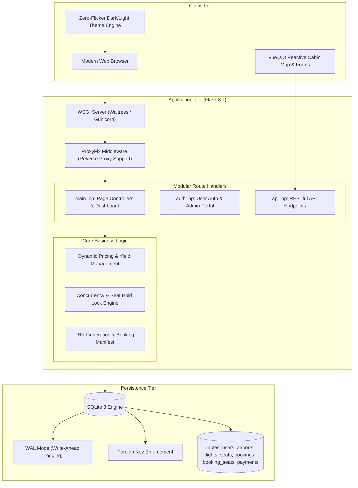

# CloudSky Airways (CSA) — Airline Reservation & Flight Management System

[](https://python.org)
[](https://flask.palletsprojects.com/)
[](https://www.sqlite.org/)
[](https://vuejs.org/)
[-brightgreen?logo=pytest&logoColor=white)](https://pytest.org/)
[](https://www.docker.com/)
[](https://github.com/nithin16-cloud/csa/actions)
[](https://opensource.org/licenses/MIT)

---

## 📌 Project Overview

**CloudSky Airways** is a full-stack commercial airline flight reservation, ticketing, and cabin simulator platform engineered with **Python/Flask 3.x**, **SQLite (with Write-Ahead Logging)**, and a **reactive Vue.js 3 frontend**.

Developed as an academic software engineering capstone project, this application models end-to-end commercial aviation workflows. It addresses real-world systems engineering challenges including **transactional concurrency locking** (zero double-booking under race conditions), **airline yield management (dynamic surge pricing)**, **multi-passenger manifest scheduling**, and **RESTful service architecture**.

### Academic & Engineering Highlights
- **Zero Double-Booking Guarantee:** Implements atomic database transactions, unique composite constraints, and 5-minute temporary reservation holds with optimistic concurrency counters (`version`).
- **Dynamic Pricing Engine:** Incorporates airline yield-management algorithms that automatically scale ticket prices based on seat occupancy tiers.
- **Interactive Cabin Map:** Visual seat selection across First Class, Business Class, and Economy layouts with live amenity metadata (seat pitch, recline angles, AC/USB-C power outlets).
- **Comprehensive Quality Assurance:** Covered by **42 automated Pytest unit and integration tests** validating concurrency isolation, route integrity, authentication security, and deployment health checks.
- **Production-Grade Architecture:** Features Docker containerization, dual WSGI support (Waitress for Windows, Gunicorn for Linux/Unix), HTTP security headers, and automated GitHub Actions CI/CD.

---

## 🏗️ System Architecture



---

## ✨ Core Features

### 1. Flight Discovery & Search Engine
- Search direct routes across major domestic and international hubs (DEL, BOM, BLR, HYD, MAA, CCU, DXB, SIN, LHR, JFK).
- Dynamic query filters for departure time, aircraft model, and budget.
- Intelligent route fallback mechanisms to suggest alternative dates if no scheduled flights match on the exact day.

### 2. Interactive Cabin Simulator & Seat Map
- Realistic commercial aircraft layouts: **First Class** (Rows 1–2, lie-flat suites, 78" pitch), **Business Class** (Rows 3–6, 42" pitch), and **Economy Class** (Rows 7–16, including exit rows with 34" pitch).
- Live amenity badges detailing power outlets (Universal AC / 65W USB-C), recline degrees, and extra legroom flags.
- Real-time seat availability state management (Available, Held, Booked, Selected).

### 3. Concurrency Control & Double-Booking Prevention
- **Temporary Seat Locking:** 5-minute atomic holds prevent other passengers from selecting the same seat during checkout.
- **Automatic Hold Release:** Expired reservation tokens are automatically released back into inventory.
- **Physical Integrity Constraints:** Enforced at database level via `UNIQUE(flight_id, seat_number)` and `UNIQUE(flight_id, seat_id)` within `booking_seats`.
- **Optimistic Concurrency Control:** Seat updates increment a `version` counter to discard stale client updates.

### 4. Dynamic Yield Management & Surge Pricing
Simulates real airline revenue management: as flight seat occupancy increases, ticket prices scale across deterministic thresholds:
| Occupancy Tier | Multiplier | Status Label | Purpose |
|---|---|---|---|
| `< 30%` Filled | **1.00x** (Base Fare) | Standard | Early booking incentive |
| `30% – 59%` Filled | **1.20x** (+20%) | Limited Seats | Mid-demand scaling |
| `60% – 84%` Filled | **1.45x** (+45%) | Filling Fast | High-demand optimization |
| `≥ 85%` Filled | **1.75x** (+75%) | High Demand | Peak scarcity revenue maximizer |

### 5. Multi-Passenger Manifest & PNR Generation
- Book individual or group itineraries with passenger names, ages, and genders.
- Automatic issuance of airline-standard 6-character PNR booking reference codes (e.g., `CS-9X4A8B`).
- Simulated payment gateway checkout with Razorpay/UPI/Card modal workflows and instant confirmation receipts.
- Printable, high-fidelity digital boarding passes complete with simulated machine-readable barcodes.

### 6. Passenger Self-Service & Web Check-in Portal
- Search reservations using **PNR + Passenger Email**.
- Interactive seat re-assignment / swap engine with immediate seat inventory updates.
- Automated reservation cancellation with dynamic fee deduction and refund balance computation.
- Digital web check-in with seat confirmation.

### 7. User Authentication & Profile Dashboard
- PBKDF2 SHA-256 cryptographic password hashing.
- Persistent session management with secure cookie policies (`HttpOnly`, `SameSite=Lax`).
- Dedicated passenger dashboard displaying personal booking statistics:
  - Total Bookings Count (Confirmed vs. Cancelled)
  - Cumulative Amount Spent (in INR ₹)
  - Total Passengers Flown
  - Detailed booking itinerary history cards

### 8. System Administration & Database Utilities
- Secure Web Admin dashboard to inspect registered passengers and flight records.
- Administrative password reset capabilities.
- Live database download/backup endpoint (`/admin/download-db`).
- Built-in Flask CLI commands for terminal administration.

---

## 🗄️ Database Design

The relational database schema is structured to ensure Third Normal Form (3NF) compliance and referential integrity:

```text
+------------------+         +--------------------+         +--------------------+
|      users       |         |      airports      |         |      flights       |
+------------------+         +--------------------+         +--------------------+
| id (PK)          |         | code (PK)          |<---+    | id (PK)            |
| name             |         | name               |    +----| origin_code (FK)   |
| email (UQ)       |         | city               |    +----| dest_code (FK)     |
| phone            |         | country            |    |    | departure_time     |
| password_hash    |         +--------------------+    |    | arrival_time       |
| created_at       |                                   |    | aircraft_model     |
+--------+---------+                                   |    | base_price         |
         |                                             |    | status             |
         | 0..*                                        |    +---------+----------+
         v                                             |              |
+------------------+                                   |              | 1..*
|     bookings     |                                   |              v
+------------------+                                   |    +--------------------+
| id (PK)          |                                   |    |       seats        |
| user_id (FK)     |                                   |    +--------------------+
| booking_ref (UQ) |                                   |    | id (PK)            |
| flight_id (FK)   |-----------------------------------+    | flight_id (FK)     |
| passenger_name   |                                        | seat_number        |
| passenger_email  |                                        | cabin_class        |
| total_amount     |                                        | seat_type          |
| payment_status   |                                        | price_multiplier   |
| refund_amount    |                                        | is_booked          |
| created_at       |                                        | locked_until       |
+--------+---------+                                        | lock_token         |
         |                                                  | version            |
         | 1..*                                             +---------+----------+
         v                                                            |
+------------------+         +--------------------+                   |
|  booking_seats   |         |      payments      |                   |
+------------------+         +--------------------+                   |
| id (PK)          |         | id (PK)            |                   |
| booking_id (FK)  |         | booking_id (FK)    |                   |
| seat_id (FK)     |<--------+--------------------+-------------------+
| passenger_name   |         | transaction_id (UQ)|
| passenger_age    |         | payment_method     |
| price_paid       |         | amount             |
+------------------+         | status             |
                             +--------------------+
```

### Key Integrity Rules
- **Foreign Keys Enabled:** `PRAGMA foreign_keys = ON;` executed on every connection.
- **Write-Ahead Logging:** `PRAGMA journal_mode = WAL;` eliminates read-write concurrency blocking.
- **Atomic Operations:** Hold and booking creations occur inside strict transaction contexts with automatic rollbacks on error.

---

## 🛠️ Technology Stack

| Domain | Technology | Description |
|---|---|---|
| **Backend Framework** | Python 3.11+ / Flask 3.x | Lightweight, modular WSGI application with Blueprints |
| **WSGI Servers** | Waitress / Gunicorn | High-concurrency production application servers |
| **Database** | SQLite 3 (WAL Mode) | Embedded ACID-compliant database engine |
| **Frontend Framework** | Vue.js 3 (Composition / Reactive) | Client-side dynamic state for cabin layout and booking |
| **Styling & UI** | Vanilla CSS (Custom Design System) | 130KB+ stylesheet, responsive grid, light/dark theme |
| **Typography & Icons** | Outfit, Plus Jakarta Sans, FontAwesome 6 | Typography and icons |
| **Testing** | Pytest 8.x | Comprehensive automated test framework |
| **Containerization** | Docker | Minimal Debian-slim multi-stage image with healthchecks |
| **Continuous Integration** | GitHub Actions | Automated build, lint, database seed, and test validation |

---

## 🚀 Getting Started

### Prerequisites
- **Python:** Version 3.11 or higher
- **Git:** Version control system
- **Docker:** (Optional, for containerized execution)

### 1. Clone the Repository
```bash
git clone https://github.com/nithin16-cloud/csa.git
cd csa
```

### 2. Set Up Virtual Environment

**Windows (PowerShell):**
```powershell
python -m venv .venv
.\.venv\Scripts\Activate.ps1
```

**macOS / Linux:**
```bash
python3 -m venv .venv
source .venv/bin/activate
```

### 3. Install Dependencies
```bash
pip install --upgrade pip
pip install -r requirements.txt
```

### 4. Configure Environment Variables
Create a `.env` file based on the provided `.env.example`:
```bash
# On Windows PowerShell
Copy-Item .env.example .env

# On Linux / macOS
cp .env.example .env
```

Default configuration in `.env`:
```env
FLASK_ENV=development
FLASK_DEBUG=1
PORT=5000
SECRET_KEY=dev-secret-key-replace-in-production
DATABASE_PATH=cloudsky.db
SESSION_COOKIE_SECURE=0
```

### 5. Initialize and Seed the Database
Execute the custom Flask CLI commands:
```bash
flask --app run.py init-db
flask --app run.py seed-db
```
*Note: If no database exists upon startup, CloudSky Airways also auto-detects and seeds initial routes and flight schedules automatically.*

### 6. Run the Application

**Development Mode (Hot Reload):**
```bash
python run.py
```

**Production Mode (WSGI Server):**
```bash
python wsgi.py
```

Open your browser and navigate to:
```text
http://127.0.0.1:5000
```

---

## 🧪 Automated Testing

The project maintains a **100% pass rate across 42 automated tests** using Pytest, covering unit validation, integration flows, and race condition prevention.

To execute the test suite:
```powershell
# With virtual environment activated:
pytest -v
```

### Test Suite Breakdown

```text
============================= test session starts =============================
platform win32 -- Python 3.14 / 3.11 -- pytest-9.1.1
collected 42 items

tests/test_auth.py (11 tests)
  * test_login_page_renders                              PASSED
  * test_register_page_renders                           PASSED
  * test_login_with_demo_credentials                     PASSED
  * test_login_invalid_password                          PASSED
  * test_register_new_user                               PASSED
  * test_register_password_mismatch                      PASSED
  * test_logout                                          PASSED
  * test_api_auth_login                                  PASSED
  * test_register_then_login_cycle                       PASSED
  * test_login_with_mobile_autocomplete_space_in_password PASSED
  * test_login_non_existent_account_feedback             PASSED

tests/test_concurrency.py (3 tests)
  * test_prevent_double_booking_sequential               PASSED
  * test_seat_hold_and_release                           PASSED
  * test_prevent_double_booking_concurrent               PASSED

tests/test_deployment.py (7 tests)
  * test_health_check_endpoint                           PASSED
  * test_api_health_check_endpoint                       PASSED
  * test_security_headers_present                        PASSED
  * test_404_html_error_page                             PASSED
  * test_404_api_json_response                           PASSED
  * test_wsgi_module_import                              PASSED
  * test_config_environments                             PASSED

tests/test_routes.py (21 tests)
  * test_home_page                                       PASSED
  * test_flights_search_page                             PASSED
  * test_booking_page                                    PASSED
  * test_manage_page                                     PASSED
  * test_api_seats                                       PASSED
  * test_multi_passenger_booking_success                 PASSED
  * test_multi_passenger_validation                      PASSED
  * test_flights_filter_view                             PASSED
  * test_seat_amenities_metadata                         PASSED
  * test_seat_query_filters                              PASSED
  * test_cabin_ui_elements                               PASSED
  * test_payment_gateway_simulation                      PASSED
  * test_booking_payment_and_boarding_pass               PASSED
  * test_seat_swap_workflow                              PASSED
  * test_cancellation_and_inventory_release              PASSED
  * test_manage_portal_views                             PASSED
  * test_api_flights_endpoint                            PASSED
  * test_main_page_featured_flights_json                 PASSED
  * test_passenger_info_routes                           PASSED
  * test_flights_search_fallback                         PASSED
  * test_logged_in_user_booking_view_and_seat_selection  PASSED

============================= 42 passed in 4.55s ==============================
```

---

## 📡 REST API Reference

All API routes return JSON responses with appropriate HTTP status codes.

| Method | Endpoint | Description | Key Parameters / Payload |
|---|---|---|---|
| `GET` | `/health` | Application & database health probe | None |
| `GET` | `/api/airports` | Retrieve all airports and IATA codes | None |
| `GET` | `/api/flights` | Search scheduled flights with surge pricing | `origin`, `destination`, `date`, `limit` |
| `GET` | `/api/flights/<id>/seats` | Retrieve aircraft seat map with live holds | `cabin_class`, `seat_type`, `extra_legroom` |
| `POST` | `/api/seats/hold` | Place 5-minute reservation hold on seats | `{ flight_id, seat_ids, session_token }` |
| `POST` | `/api/seats/release` | Release active seat holds | `{ flight_id, seat_ids, session_token }` |
| `POST` | `/api/bookings` | Confirm booking and generate PNR | `{ flight_id, seat_ids, passengers, contact }` |
| `GET` | `/api/bookings/<pnr>` | Fetch booking manifest by PNR reference | `pnr` in URL path |
| `POST` | `/api/bookings/<pnr>/change-seat`| Change booked seat to available seat | `{ old_seat_id, new_seat_id }` |
| `POST` | `/api/bookings/<pnr>/cancel` | Cancel booking and release seats | `{ reason }` |
| `POST` | `/api/payments/simulate` | Simulate payment transaction | `{ booking_id, method, amount }` |
| `POST` | `/api/auth/register` | Register new passenger account | `{ name, email, phone, password }` |
| `POST` | `/api/auth/login` | Authenticate passenger and start session | `{ email, password }` |
| `POST` | `/api/auth/logout` | Terminate passenger session | None |
| `GET` | `/api/auth/me` | Fetch authenticated passenger profile | Session cookie |

---

## 💻 CLI Commands

The application provides dedicated terminal commands registered with Click:

```bash
# Initialize clean database schema
flask --app run.py init-db

# Populate airports, aircraft schedules, and default accounts
flask --app run.py seed-db

# List all registered passenger records in tabular format
flask --app run.py list-users
```

---

## 🐳 Docker Deployment

The project includes an optimized `Dockerfile` adhering to container security best practices:
- Runs as a **non-root user** (`cloudsky`, UID 1001).
- Includes an active **HEALTHCHECK probe** querying `/health`.
- Multi-threaded production execution via **Gunicorn**.

### Build and Run with Docker

```bash
# Build the Docker image
docker build -t cloudsky-airways:latest .

# Run container with persistent data volume mapping
docker run -d \
  -p 5000:5000 \
  -e SECRET_KEY="production-secret-key" \
  -v cloudsky_data:/app/data \
  --name cloudsky-app \
  cloudsky-airways:latest
```

Verify container status:
```bash
docker ps
docker logs -f cloudsky-app
```

---

## 📁 Repository Structure

```text
csa/
├── .github/
│   └── workflows/
│       └── ci.yml               # GitHub Actions CI matrix (Python 3.11 & 3.12, Pytest, Docker)
├── app/
│   ├── routes/
│   │   ├── __init__.py          # Blueprint package declarations
│   │   ├── api.py               # REST API endpoints (Seat holds, bookings, cancellations)
│   │   ├── auth.py              # User authentication, admin dashboard, credential manager
│   │   └── main.py              # Page controllers, search views, dashboard history
│   ├── static/
│   │   └── css/
│   │       └── style.css        # Luxury design system, theme variables, responsive styles
│   ├── templates/
│   │   ├── auth/                # Login and user registration views
│   │   ├── errors/              # Custom 404 and 500 error templates
│   │   ├── base.html            # Core layout with navigation, footer, theme engine
│   │   ├── booking.html         # Vue.js interactive cabin simulator & checkout
│   │   ├── dashboard.html       # Passenger personal booking history & metrics
│   │   ├── flights.html         # Flight schedule search results & filters
│   │   ├── index.html           # Landing page with hero search & featured routes
│   │   ├── info.html            # Passenger information, guidelines, policies
│   │   └── manage.html          # PNR management, web check-in, seat swap portal
│   ├── __init__.py              # Application factory, security headers, CLI commands
│   ├── config.py                # Environment configurations (Dev, Prod, Test)
│   ├── db.py                    # SQLite connection manager, WAL mode, migrations
│   ├── schema.sql               # Relational database schema definitions
│   └── seed.py                  # Seed script for airports, flight routes, and seats
├── tests/
│   ├── test_auth.py             # Authentication and credential validation tests
│   ├── test_concurrency.py      # Concurrency locking and double-booking tests
│   ├── test_deployment.py       # WSGI, environment, and healthcheck tests
│   └── test_routes.py           # Route rendering, booking, payment, and swap tests
├── .dockerignore                # Build exclusions for Docker context
├── .env.example                 # Environment configuration template
├── .gitignore                   # Version control ignore definitions
├── Dockerfile                   # Hardened production container image specification
├── Procfile                     # Deployment process declaration for cloud platforms
├── pytest.ini                   # Pytest discovery and options configuration
├── requirements.txt             # Pinned project dependencies
├── run.py                       # Development server entry point
├── wsgi.py                      # Production WSGI application entry point
└── README.md                    # Comprehensive technical documentation
```

---

## 👨‍💻 Author & Academic Portfolio

**Nithin T**
- **GitHub:** [@nithin16-cloud](https://github.com/nithin16-cloud)
- **Repository:** [https://github.com/nithin16-cloud/csa](https://github.com/nithin16-cloud/csa)
- **Role:** Full-Stack Developer & Software Engineering Student
- **Focus Areas:** Distributed systems concepts, transactional concurrency, web application architecture, and automated testing.

---

## 📄 License

This project is licensed under the **MIT License**. See the [LICENSE](LICENSE) file for complete details.
